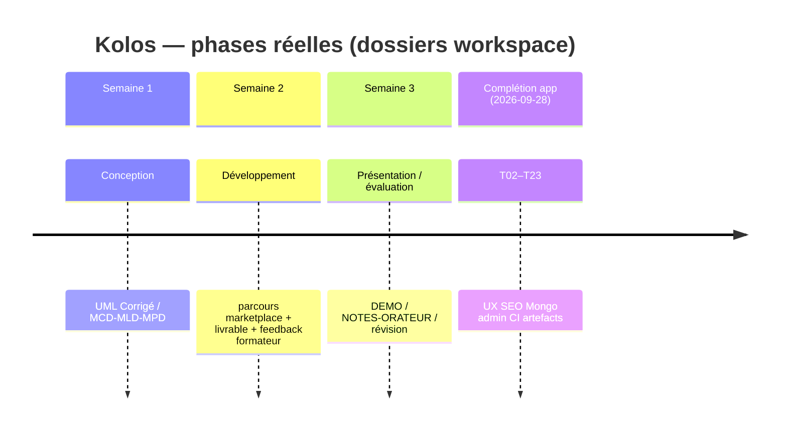

# Frise chronologique Kolos — sources réelles (T22)

**Date :** 2026-09-28  
**Statut :** frise **factuelle** à partir des dossiers Semaines 1–3 + journal de complétion.  
**Pas** de board Jira/Trello inventé.

## Frise (phases formation 3WA)

| Phase | Dossier / preuve | Contenu réel |
|-------|------------------|--------------|
| **Semaine 1 — Conception** | `Kolos Semaine 1 - Conception/` | UML, MCD/MLD/MPD |
| **Semaine 2 — Développement** | `Kolos Semaine 2 - Gestion de Projet et Developpement/` | Livrable développement + **feedback** formateur |
| **Semaine 3 — Présentation** | `Kolos Semaine 3 - Presentation Evaluation/` | DEMO-60s, NOTES-ORATEUR, fiche révision |
| **Complétion (hors semaine nominale)** | `journal_completion.md` + branches `feat/completion-t*` | T02→T21 faits le **2026-09-28** ; T22/T23 suite |

## Cycle de travail (réponse feedback Semaine 2)

Aligné dossier / pratique réelle : **UML/MPD → use case → tests → UI** (parcours publier → candidater → sélectionner → `AWAITING_PAYMENT`).

## Manque assumé — 2026-09-28

| Élément demandé (feedback Semaine 2 / gabarit §4) | Statut |
|---------------------------------------------------|--------|
| Frise « sprints » type board Agile (Jira/Trello/Notion) avec dates de sprint inventées | **Absent** — projet mené en **3 semaines formation** + backlog Txx, **sans** outil de sprints formels |
| Captures d’écran d’un outil de gestion de sprints | **Absent** — non utilisé |
| Comptes rendus de réunion d’équipe | **Absent** — projet solo formation |

Cette section satisfait le critère plan T22 : *« Frise sprints si données réelles ; sinon liste le manque sans inventer »* — ici frise **phases réelles** + manque board Sprint **daté**.
